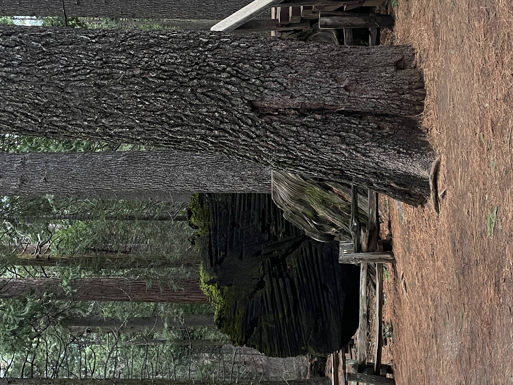
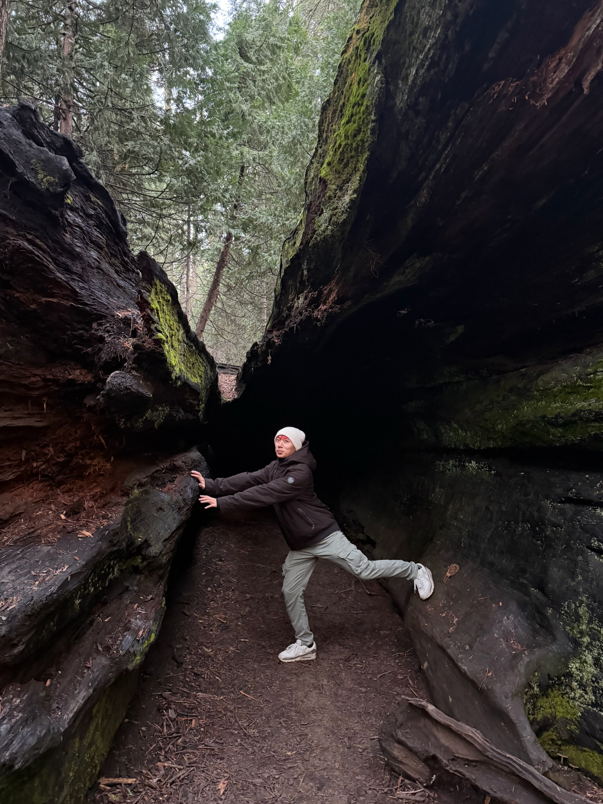
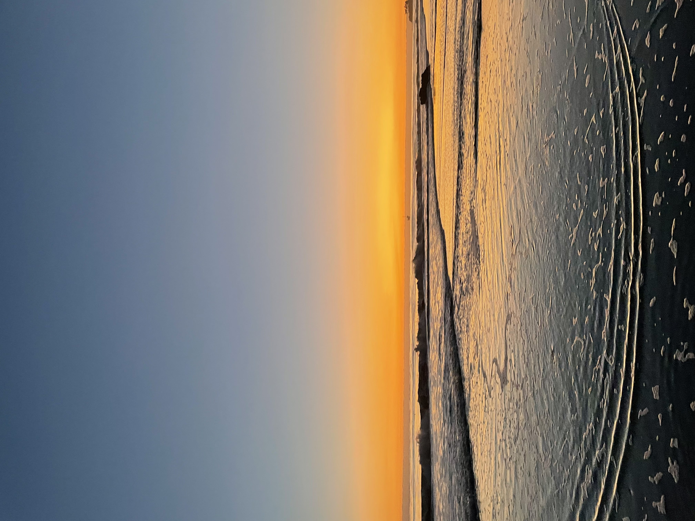
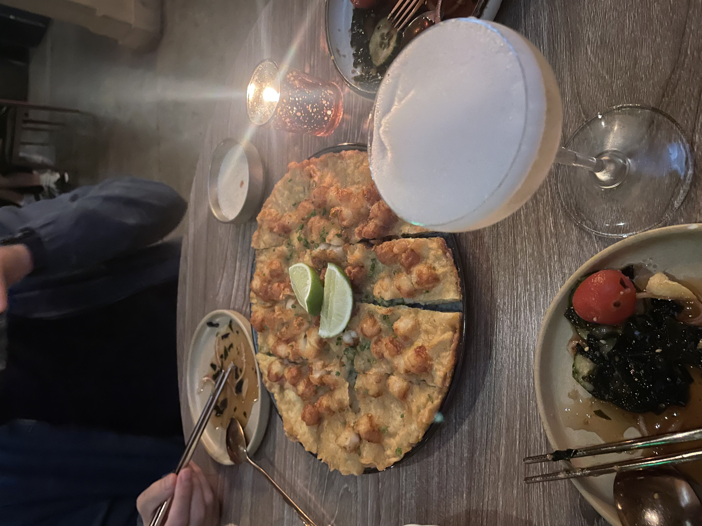
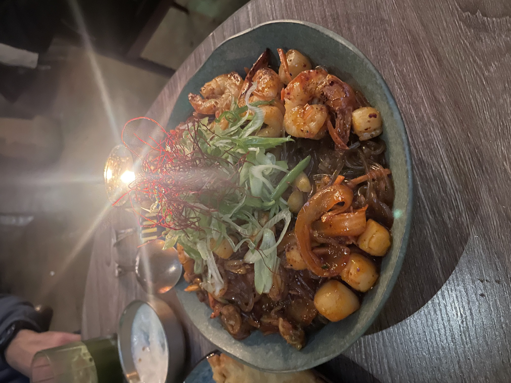

Hi! My name is Henderson and I am a third-year undergraduate at UC Santa Barbara studying Environmental Studies and Statistics & Data Science. I'm interested in leveraging data science tools to investigate climate change impacts across environmental systems.

## My places

I really love trees. I knew that I loved trees for the first time during my sixth-grade camping trip (my first ever camping trip) and I smelled the petrichor as I stepped off the bus. Since then, I always imagined myself working with trees in some capacity--urban forestry, forest restoration, ecohydrological research, to name a few.

::::: {layout-style="auto" layout-nrow="1"}
::: figure
{.regular-hover}
:::

::: figure
{.regular-hover}
:::

::: figure
{.regular-hover}
:::
:::::

That being said, I actually didn't grow up seeing many forests at all. I am originally from Sacramento, CA so all of my adventures branch out from there. My favorite thing to do there is to visit my favorite independent coffee shops and enjoy a drink that's a little too expensive. But it makes for a great meeting place to see old friends.

::::: columns
::: {.column width="55%"}
Starting university, I moved to Santa Barbara, which was easily one of the best decisions I have made. One of my favorite things about living here are the sunsets. I like to walk the trails on the bluffs leading to Sands Beach near UCSB's Coal Oil Point Reserve. It's a great unwinding activity to do with friends.

I've also had the privilege of travelling across California and abroad. Since starting university, I've slowly increased my area of visitation outside of my NorCal bubble. Check out my Travels page for more details.
:::

::: {.column width="45%"}
{width="90%" fig-align="right"}
:::
:::::

## My food

I'm not competitive about it, but I consider myself to be a pretty big foodie. Let me walk you through my top three eats of the past year.

#### Danbi, Los Angeles, CA

------------------------------------------------------------------------

::::: {layout-style="auto" layout-nrow="1"}
::: figure
{.regular-hover width="75%"}
:::

::: figure
{.regular-hover width="75%"}
:::
:::::

I came to Danbi for dinner before seeing PinkPanthress in concert for the Fancy That tour. I seriously tried to hold back from eating too much so that I could dance later in the night. Danbi is a Korean-fusion restaurant featured on the [Michelin Guide](https://guide.michelin.com/us/en/california/us-los-angeles/restaurant/danbi), and for good reason in my opinion! The atmosphere and service were 10/10. The crispy scallop pancake with mentaiko sauce was supposed to be the appetizer of the night, but honestly I liked it so much that I was full before the main dish came out, which was also outstanding. The seafood japchae had everything that I like about food in it: grilled shrimps and scallops on a bed of spicy glass noodles. It was warm, filling, and so satisfying to eat.

#### Jonesey's Fried Chicken, Santa Barbara, CA

------------------------------------------------------------------------

::::: columns
::: {.column width="35%"}
{width="95%"}
:::

::: {.column width="65%"}
If you are a fan of fried chicken, this is the place I have to recommend if you ever decide to visit Santa Barbara. Breading? Crispy. Chicken? Huge. Flavor? On point. I say this as a self-proclaimed chicken expert. Plus, the service is great!

There's honestly not much more for me to say about this. I will keep coming back. 
:::
:::::

#### Helena's Kitchen, Playa Blanca, Costa Rica

------------------------------------------------------------------------

::::: columns
::: {.column width="65%"}
Okay, so this place isn't actually a restaurant. I literally mean Helena's kitchen, Helena being my wonderful host when I did my field course in Costa Rica. She fed us three meals a day, which often included the classic base of rice and beans. I don't normally eat rice and beans as the bulk of my meals, but I would change that in a heartbeat if Helena cooked it for me. 

Here's a picture of my rice and beans with some plantain chips on the side (on top of it). Fun fact: it was actually raining when I took this photo, and I had to hold it underneath my rain jacket's hood as I hunched over so that my food wouldn't get wet. Things just happen out in the field!
:::

::: {.column width="35%"}
{width="90%" fig-align="right"}
:::
:::::

## My plans

Throughout my undergraduate career, I've had the opportunities to both conduct my own independent research projects as well as assist on long-term research in a faculty lab. I hope to continue doing research as I progress in my career, and so I plan on pursuing graduate school after I complete my bachelor's degree, ideally PhD programs in environmental science.

Outside of my career, I hope to be able to travel much more. My goal is to have visited all seven continents! Right now, I have plans to visit New Orleans, LA in the Spring. I'm a little late for Mardis Gras, but am nonetheless very excited to travel out-of-state.

I also aspire to be the parent to a cat *and* a dog. I actually do already have three Pomeranian friends in my home in Sacramento, so I am really already halfway there.
