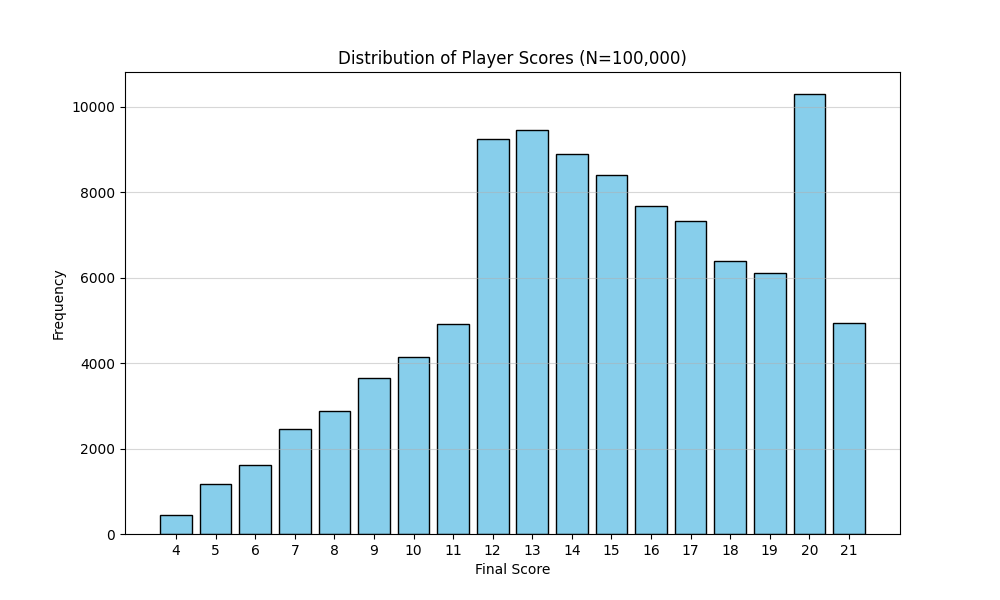

## Predicting sea turtle nesting behavior in Costa Rica

In August 2025, I had the most fortunate opportunity to take a field course in Playa Blanca, Costa Rica where I assisted on local sea turtle conservation efforts.

::::: {layout-nrow="1"}
::: figure
{.regular-hover}
:::

::: figure
{.regular-hover}
:::
:::::

I concluded my work by writing a final report on my own research question relating to Olive ridley nesting. Thinking like a climate scientist, I wondered how different weather conditions might affect the frequency of arribada nesting events, which are an evolutionary response to predation meant to increase recruitment.

You can read about my findings [here](https://drive.google.com/drive/folders/1k61FavMsGzgUaESVVAYog51y8TfDfY2P).

{width="100%" height="700px"}

## Monte Carlo Simulation: Blackjack

If you don't know, blackjack is a common card game where the dealer and the players all try to attain cards whose values accumulate as close to 21 without surpassing it. As a player, you start with two cards and can either "hit" or "pass", meaning you can choose to receive another card from the dealer or choose to not take any more cards.

I wanted to know how likely it is that a player would win if they always choose to pass and keep their two cards. So, I scripted a simulation in Python to test it out. Over 100,000 iterations, I began to see the win rate converge around 42% and the tie ("push") rate converge around 5%. Once again, the house takes the advantage, albeit marginally. Special thanks to Dr. Jeff Moehlis for assigning me this unique project!

Learn more on my [GitHub](https://github.com/hendersonvo/monte-carlo_card-sim).

```{r}
#| echo: false
#| message: false
#| warning: false
library(reticulate)
```

```{python}
#| eval: false
#| code-fold: true

import random
import matplotlib.pyplot as plt

def card_value(number):
    ''' returns the value of a card according to their position in a list of 52 standard cards, defined by a table
        param number is any integer from 0 to 51
    '''
    if number not in list(range(52)):
        print("Not a valid card")
    elif number in ([0, 10, 20, 30, 40, 41, 42, 43, 44, 45, 46, 47, 48, 49, 50, 51]): # corresponds to a 10, J, Q, or K
        return 10
    else:
        number = number % 10
        return number

def player(cards):
    ''' returns the score of the player's hand calculated from the first two cards in the deck
        param cards is a list of integers
    '''
    ace_count = 0 # initializing the number of times the player draws an ace
    score = 0 # initializing total score

    for i in cards[0:2]:
        if card_value(i) == 1 and ace_count == 0:
            score += 11 # adds 11 to score for the first ace
            ace_count += 1
        else:
            score += card_value(i)
    return score
        

def dealer(cards):
    ''' returns the score of the dealer after drawing enough cards to have a hand equal to or greater than 17
        param cards is a list of integers
    '''
    score = 0 
    i = 2 
    while score < 17: 
        score += card_value(cards[i])
        i += 1 
    return score

num_games = 100000

# initialize player wins, pushes, win streaks, and score dictionary

num_wins = 0
num_push = 0

win_streak = 0
longest_streak = 0

score_dict = {}
for i in range(4, 22):
    score_dict.update({i: 0})


for i in range(num_games):
    cards = list(range(52))
    random.shuffle(cards)
    p = player(cards) 
    score_dict[p] += 1 
    d = dealer(cards) 

    if p > d or d > 21: 
        num_wins += 1
        win_streak += 1

        if win_streak > longest_streak: 
            longest_streak = win_streak
    elif p == d:
        num_push += 1 
    elif p < d:
        win_streak = 0 


win_prob = num_wins / num_games
push_prob = num_push / num_games

print(f"Probability player wins: {win_prob * 100:.4f}%")
print(f"Probability of push: {push_prob * 100:.4f}%")
print(f"Longest winning streak: {longest_streak} games")
print(score_dict)

# Extract data for plotting
scores = list(score_dict.keys())
frequencies = list(score_dict.values())

# Create a bar chart
plt.figure(figsize=(10, 6))
plt.bar(scores, frequencies, color='skyblue', edgecolor='black')
plt.title(f'Distribution of Player Scores (N={num_games:,})')
plt.figtext(0.7, 0.01, f"Probability player wins: {win_prob * 100:.4f}%\n\
Probability of push: {push_prob * 100:.4f}%\n\
Longest winning streak: {longest_streak} games", wrap = True, fontsize=8, color='gray')
plt.xlabel('Final Score')
plt.ylabel('Frequency')
plt.xticks(scores)
plt.grid(axis='y', alpha=0.5)

# Save the plot and display
plt.savefig('distribution_plot.png')
plt.show()
```


