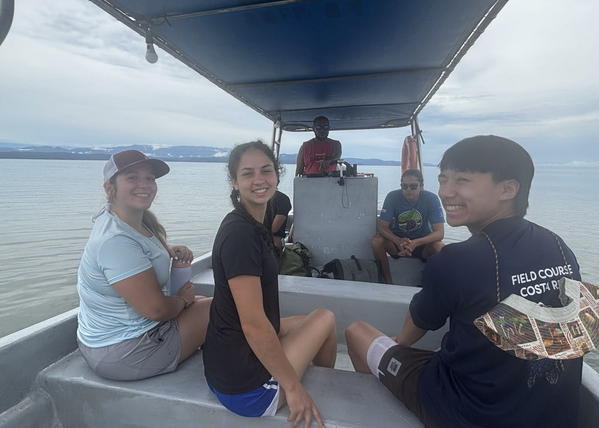
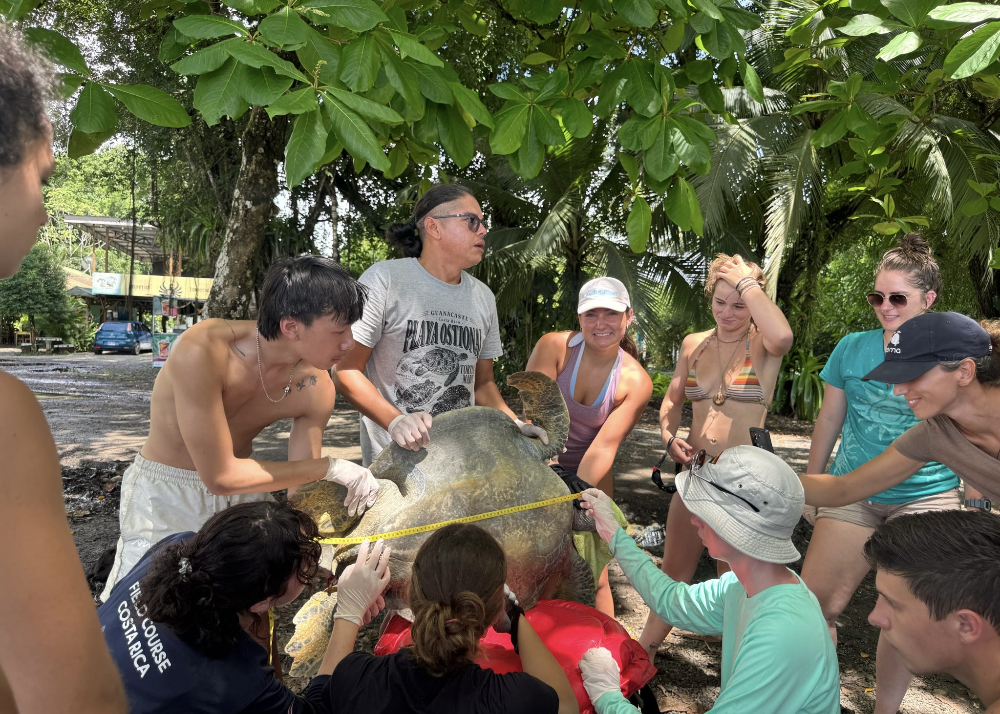

\newline

## Predicting sea turtle nesting behavior in Costa Rica

In August 2025, I had the most fortunate opportunity to take a field course in Playa Blanca, Costa Rica where I assisted on local sea turtle conservation efforts.

::::: {layout-nrow="1"}
::: figure
{.regular-hover}
:::

::: figure
{.regular-hover}
:::
:::::

I concluded my work by writing a final report on my own research question relating to Olive ridley nesting. Thinking like a climate scientist, I wondered how different weather conditions might affect the frequency of arribada nesting events, which are an evolutionary response to predation meant to increase recruitment.

You can read about my findings [here](turtle_paper.pdf).

{width="100%" height="700px"}
