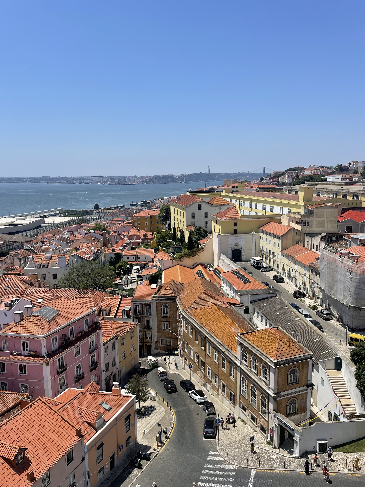
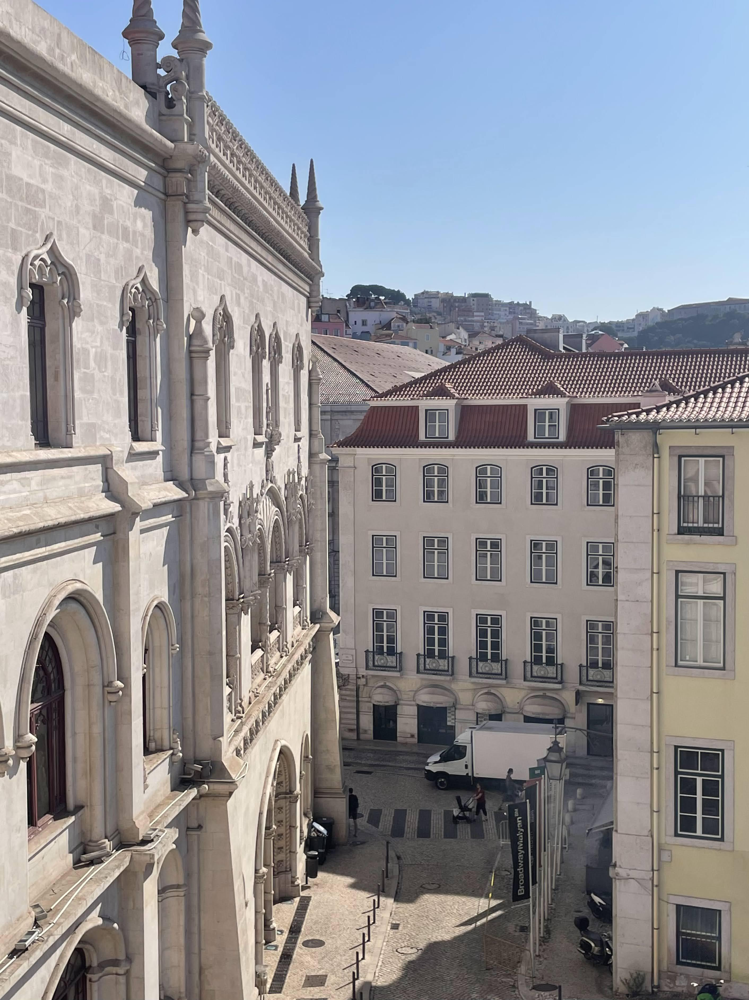
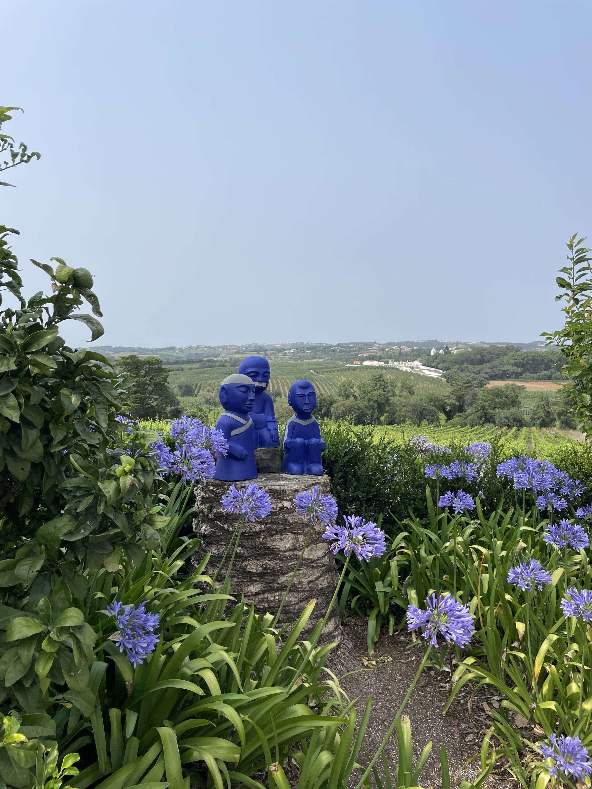
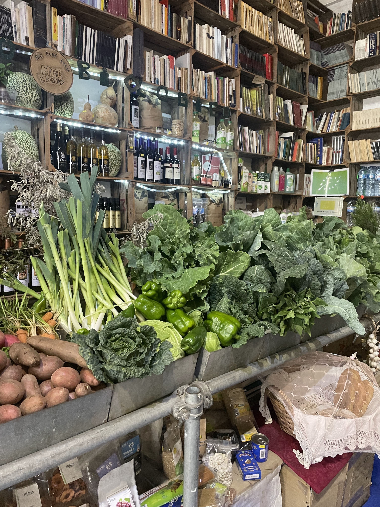
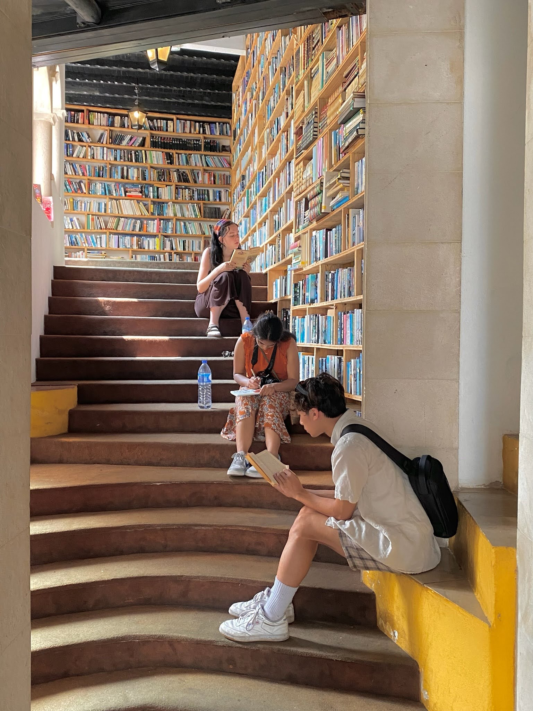
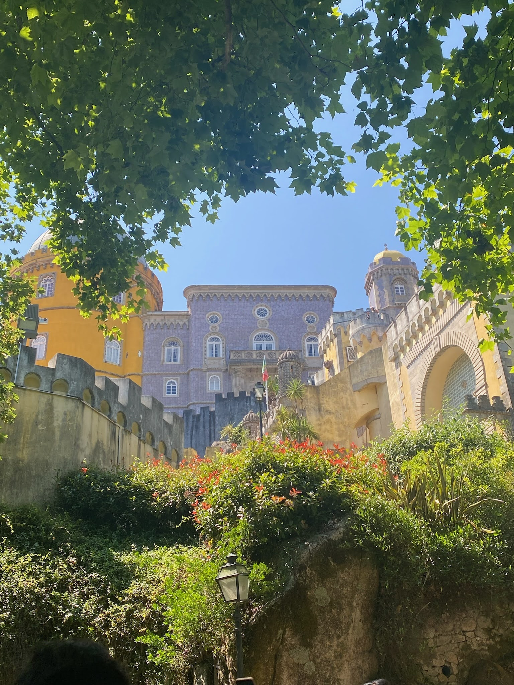
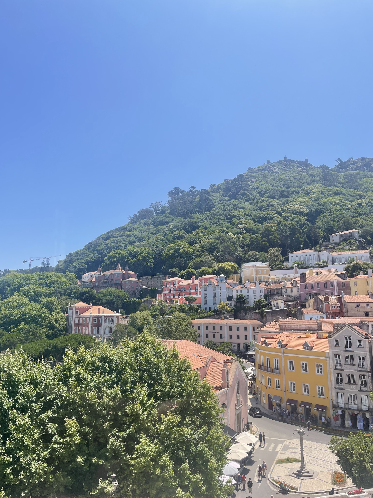

## Oh, the places I've been?

It turns out that I've taken over 11,000 photos in the past five years that have location data attached to them. Come with me to revisit some of the places I've been!

```{r}
#| label: Coding the interactive map
#| message: false
#| warning: false
#| code-fold: true

# load packages
library(leaflet)
library(tidyverse)

# load data
gps <- read_csv("data/photo_gps_updated.csv")

# initialize map ----
site_map <- leaflet() |>  
  
  # add base map tiles (use `addTiles()` for Google maps tiles, OR `addProviderTiles()` for 3rd party base maps: https://leaflet-extras.github.io/leaflet-providers/preview/) ----
  addProviderTiles(providers$Esri.WorldImagery, group = "ESRI World Imagery") |>  
  addProviderTiles(providers$Esri.OceanBasemap, group = "ESRI Oceans") |> 
  
  # add mini map ----
  addMiniMap(toggleDisplay = TRUE, minimized = TRUE) |> 
  
  # set view over Santa Barbara Channel ----
  setView(lng =  -119.83, lat = 34.44, zoom = 9) |> 
  
  # add location bubbles and markers ----
  addMarkers(data = gps, clusterOptions = markerClusterOptions(),
             lng = ~longitude, lat = ~latitude,
             popup = paste("Location:", gps$location, "<br>",
                           "Coordinates (lat/long):", gps$latitude, ",",
                           gps$longitude)) |> 

  
  # add layers control ----
  addLayersControl(
    baseGroups = c("ESRI World Imagery", "ESRI Oceans"))


# print map ----
site_map
```

------------------------------------------------------------------------

## Portugal, Summer 2023

Here are some of my favorite moments from my first international trip! This was a milestone moment for myself before starting my university life.

:::::::::: {layout-style="auto" layout-ncol="3"}
::: figure
{.regular-hover}
:::

::: figure
{.regular-hover}
:::

::: figure
{.regular-hover}
:::

::: figure
{.regular-hover}
:::

::: figure
{.regular-hover}
:::

::: figure
{.regular-hover}
:::

::: figure
{.regular-hover}
:::
::::::::::
